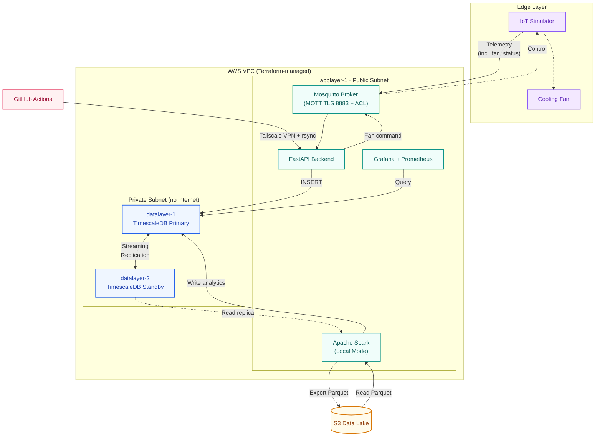

# IoT Big Data: Factory Telemetry & Control Pipeline

An end-to-end IoT telemetry ingestion, processing, and closed-loop control system built on AWS with self-hosted open-source components. Designed to monitor factory environments in real time, trigger actuator responses within milliseconds, and archive sensor data for long-term analytics.

### Project Highlights
- **✔ Secure MQTT over TLS** on port 8883 with Mosquitto broker
- **✔ High Availability TimescaleDB Replication** with active streaming slots
- **✔ Apache Spark Batch Analytics** for hourly aggregation and anomaly detection
- **✔ Amazon S3 Data Lake** with compressed Parquet archival
- **✔ Infrastructure as Code** via Terraform (VPC, IAM, compute, networking)
- **✔ Observability with Grafana** including Prometheus, Alloy agents, and Telegram alerts
- **✔ GitHub Actions Deployment** with Tailscale VPN integration
- **✔ Private AWS Networking** with air-gapped database nodes in isolated subnets

---

## Versions

| Version | Tag | Summary |
|:---|:---|:---|
| v1.0 | [`v1.0-college-project`](docs/versions/v1.0.md) | College deadline release — core pipeline, manual provisioning |
| v2.0 | [`v2.0`](docs/versions/v2.0.md) | Terraform IaC, CI/CD, closed-loop control, provisioning automation |

---

## Project Overview

This project builds a full-stack IoT monitoring pipeline for a simulated manufacturing facility. Sensors across three factory zones continuously stream temperature, vibration, and gas readings to a cloud backend over MQTT. The backend validates, stores, and analyzes the data in real time, and when a dangerous condition is detected (e.g., overheating), it publishes a control command back to the device within milliseconds.

The raw telemetry is stored in a TimescaleDB time-series database with automatic partitioning. For long-term retention and heavy analytical workloads, data is exported hourly to Amazon S3 as compressed Parquet files and processed by Apache Spark batch jobs running in local mode on the application host.

The entire infrastructure (networking, compute, security, secrets) is defined as Terraform code and can be deployed from scratch with a single command.

---

## Why This Project? (Design Philosophy)

### The Use Case

The system monitors three operational zones inside a factory:

| Zone | Sensors | Business Risk |
|:---|:---|:---|
| **Production Area** (`ruang_produksi`) | Temperature, Vibration (MPU6050) | Machine overheating or bearing wear halts the assembly line |
| **Soldering Area** (`ruang_penyolderan`) | Temperature, Gas/VOC (MQ-135) | Toxic flux fumes endanger worker health and violate safety regulations |
| **Storage Area** (`ruang_penyimpanan`) | Temperature | Excessive heat damages stored components and raw materials |

The factory needs:
- **Instant reaction**: If a soldering station overheats, the cooling fan must activate in milliseconds, not minutes.
- **Audit trail**: Regulatory bodies require months of environmental records, but storing raw high-frequency data in a database indefinitely is financially unsustainable.
- **Minimal downtime**: The monitoring system itself cannot be a single point of failure. If the database goes down, a hot standby must take over without data loss.

### Why Self-Hosted Instead of Managed Services?

This project deliberately uses self-hosted open-source components instead of managed cloud services (RDS, EMR, IoT Core) to demonstrate deep systems engineering knowledge:

| Our Decision | Production Alternative | What We Demonstrate |
|:---|:---|:---|
| PostgreSQL + TimescaleDB on EC2 | Amazon RDS / Aurora | Streaming replication configuration, WAL management, manual failover procedures |
| Spark on EC2 (local mode + experimental distributed workers) | AWS EMR / Glue | Ephemeral worker lifecycle benchmarking, coordination overhead analysis, Amdahl's Law validation |
| Docker Compose on a single host | ECS / EKS (Kubernetes) | Container networking, volume persistence, service dependency management |
| Self-hosted Mosquitto | AWS IoT Core / HiveMQ Cloud | TLS certificate provisioning, ACL enforcement, pub/sub topic architecture |

> In a production environment, managed services would be preferred for operational efficiency. The engineering skills demonstrated here (configuring replication slots, debugging VPC routing, analyzing distributed computing overhead) transfer directly to operating and debugging those managed platforms.

---

### System Architecture


---

## Infrastructure

### AWS Network Topology

The infrastructure runs on a custom VPC with public and private subnets in `ap-southeast-1`:

| Subnet | CIDR | What Lives Here | Internet Access |
|:---|:---|:---|:---|
| **Public** (`10.x.1.0/24`) | Bastion / App host | Mosquitto, FastAPI, Grafana, Spark Master | Yes (via Internet Gateway) |
| **Private** (`10.x.2.0/24`) | Database + Workers | TimescaleDB Primary, Standby, Spark Workers | None (air-gapped) |

### Security Boundaries
- Database nodes have **no public IP** and **zero internet routing**. All S3 communication goes through the free VPC Gateway Endpoint over AWS internal fiber.
- SSH access to private nodes is only possible by jumping through the Bastion host, which requires Tailscale VPN authentication.
- Grafana dashboards are exposed via Cloudflare Tunnel, so no raw web ports are open to the public internet.

### Deployment Flow
Infrastructure is provisioned entirely through Terraform. On `terraform apply`, a `local-exec` provisioner automatically:
1. Uploads provisioning scripts and database packages to S3.
2. Waits for the Bastion's SSM agent to come online.
3. Triggers remote package synchronization via AWS SSM Run Command.
4. Database nodes poll S3 for the completion flag, then install and configure PostgreSQL, TimescaleDB, and streaming replication autonomously.

---

## Technology Stack

| Category | Technologies |
|:---|:---|
| **Languages** | Python 3.12, SQL, Bash, HCL |
| **Backend** | FastAPI, Pydantic, Paho MQTT, Uvicorn |
| **Database** | PostgreSQL 16, TimescaleDB 2.x (hypertables + retention policies) |
| **Analytics** | Apache Spark 3.5, PySpark |
| **Broker** | Eclipse Mosquitto (MQTT over TLS) |
| **Cloud** | AWS EC2, S3, IAM, SSM Parameter Store, VPC Gateway Endpoints |
| **Infrastructure** | Terraform, Docker Compose, Tailscale VPN, Cloudflare Tunnel |
| **Monitoring** | Prometheus, Grafana, Grafana Alloy, Postgres Exporter |
| **CI/CD** | GitHub Actions |

---

## Performance Evaluation

> *This section is updated as new benchmarks are conducted.*

Benchmarked on AWS `t3.small` nodes (1 vCPU, 2GB RAM) running Apache Spark 3.5.

### 1,000,000 Records (~64MB Parquet)
| Scenario | Workers | Avg Duration |
|:---|:---|:---|
| Local Mode | 0 | **28.56 s** |
| 1 Distributed Worker | 1 | **42.47 s** |
| 2 Distributed Workers | 2 | **44.13 s** |

**Finding: Negative Scaling.** For datasets smaller than single-node RAM capacity, distributed coordination overhead (JVM startup, network shuffles, database connection contention) exceeds the parallel computation benefit.

### 5,000,000 Records (~320MB Parquet)
| Scenario | Workers | Result |
|:---|:---|:---|
| Local Mode (Master Only) | 0 | **Fatal Crash (OOM)** |
| 1 Distributed Worker | 1 | **155.77 s** |
| 2 Distributed Workers | 2 | **211.29 s** |

**Finding: The Architectural Necessity of Distribution.** When processing the massive 5M dataset, `Local Mode` instantly exhausted the master node's 512MB heap limit, causing a fatal OS kernel panic due to a `tmpfs` RAM disk spill. Offloading the compute to dedicated Ephemeral Workers protected the master node and successfully completed the analytics. 1 Worker remained faster than 2 Workers due to database lock contention.

Detailed analysis and Amdahl's Law breakdown available in the [Spark Analytics Guide](docs/spark-analytics.md).

---

## Engineering Challenges & Lessons Learned

- **Resource contention forced architectural decoupling.** Running PostgreSQL, Spark, and the FastAPI backend on a single host caused database connection drops during batch processing. This led to separating the database into dedicated private subnet nodes, eliminating resource contention entirely.
- **Private subnets block everything, including software installation.** Database nodes in the private subnet cannot reach external package repositories. We built a package sync pipeline: the Bastion downloads all RPMs, uploads them to S3, and private nodes pull packages through the free VPC Gateway Endpoint.
- **Distributed computing isn't a silver bullet, but it's an architectural necessity.** Adding Spark workers made the job slower for a 64MB dataset due to coordination overhead (JVM startup, network shuffles, S3 API latency), validating Amdahl's Law in practice. However, for a 320MB dataset, running in Local Mode caused a fatal OS-level kernel panic due to a `/tmp` RAM disk spill. Ephemeral distribution became mandatory to protect the master node from catastrophic Out-Of-Memory crashes. *Note: The daily production workflow runs in Local Mode for cost and simplicity; ephemeral distribution was validated as a scaling path for datasets exceeding single-node memory capacity.*
- **Infrastructure provisioning has hidden timing dependencies.** Terraform's `local-exec` fires before the SSM agent finishes registering on a new EC2 instance. We resolved this by polling `PingStatus = Online` before sending remote commands.

---

## Repository Structure

```text
iot-bigdata-project/
├── .github/workflows/          # CI/CD pipeline definitions
│
├── backend/                    # Real-time telemetry ingestion service
│   ├── app/
│   │   ├── main.py             # Application entrypoint
│   │   ├── db.py               # Database connection management
│   │   ├── models/             # Pydantic data validation schemas
│   │   ├── mqtt/               # MQTT data ingestion
│   │   └── routes/             # REST API endpoints
│   └── requirements.txt
│
├── simulator/                  # Device telemetry simulator
│   └── simulator.py
│
├── spark-jobs/                 # Batch analytics pipeline
│   ├── batch_analytics.py      # Aggregation and anomaly detection
│   ├── export_to_parquet.py    # Database to S3 export
│   ├── run_hourly_pipeline.sh  # Pipeline orchestrator
│   └── run_with_worker.sh      # Ephemeral worker launcher
│
├── benchmarks/                 # Performance testing and comparison
│   ├── results/                # Benchmark reports
│   └── *.py                    # Test scripts
│
├── db/
│   └── init.sql                # Database schema and hypertable setup
│
├── grafana/provisioning/       # Grafana as-code provisioning
│   ├── alerting/               # Alert rules and notification policies
│   ├── dashboards/             # Dashboard definitions
│   └── datasources/            # Data source connections
│
├── infra/                      # Infrastructure and deployment
│   ├── docker-compose.yml      # Container orchestration
│   ├── mosquitto/              # MQTT broker configuration
│   ├── prometheus/             # Metrics collection configuration
│   ├── alloy/                  # Monitoring agent configuration
│   ├── systemd/                # Service and timer definitions
│   ├── scripts/                # Bootstrap and provisioning automation
│   └── terraform/              # Infrastructure as Code
│       ├── compute.tf          # EC2 instances and provisioners
│       ├── network.tf          # VPC, subnets, and routing
│       ├── security.tf         # Security groups and rules
│       ├── secrets.tf          # SSM Parameter Store
│       └── environments/       # Per-environment variable files
│
└── docs/                       # Technical documentation
    ├── infrastructure.md       # AWS topology and architecture
    ├── database.md             # Replication and failover procedures
    ├── spark-analytics.md      # Pipeline design and benchmarks
    ├── edge-device-integration.md  # Payload schemas and MQTT specs
    ├── retrospective.md        # Engineering failures and fixes
    └── adr/                    # Architecture Decision Records
```

---

## Documentation

| Document | Description |
|:---|:---|
| [Infrastructure Guide](docs/infrastructure.md) | VPC topology, security groups, IAM policies, and architecture decisions |
| [Database Runbook](docs/database.md) | TimescaleDB setup, streaming replication, and failover procedures |
| [Spark Analytics Guide](docs/spark-analytics.md) | Batch pipeline design, ephemeral workers, and scaling benchmarks |
| [Edge Integration Specs](docs/edge-device-integration.md) | MQTT payload schemas, validation rules, and NTP synchronization |
| [Staging Retrospective](docs/retrospective.md) | Chronological catalog of infrastructure failures and fixes |
| [ADR-001](docs/adr/ADR-001-decouple-database-layer.md) | Architecture Decision Record: Decouple Database Layer |

---

## Project Status

> *This project is under active development. Status is updated as features are verified.*

| Component | Status |
|:---|:---|
| Real-time MQTT ingestion and closed-loop control | ✅ Verified |
| TimescaleDB primary-standby replication | ✅ Verified |
| Terraform IaC and zero-touch bootstrapping | ✅ Verified |
| PySpark batch analytics (Local Mode) | ✅ Verified |
| Grafana observability and Telegram alerting | ✅ Verified |
| CI/CD pipeline (GitHub Actions + Tailscale) | ✅ Verified |

---

## Future Improvements

While the current architecture successfully proves the end-to-end flow of IoT telemetry, the following evolution paths are identified for operational maturity and deeper systems engineering practice:

### Near-Term (Planned)
- **Configuration Management (Ansible):** Replace fragile bash provisioning scripts (`provision-db-primary.sh`, `provision-db-replica.sh`, `setup-alloy-nodes.sh`) with idempotent Ansible playbooks. Current scripts are not safe to re-run on a live system; Ansible ensures repeatable, declarative configuration for database nodes and monitoring agents.
- **Custom AMI Pipeline (Packer):** Bake PostgreSQL, TimescaleDB, Alloy, Java, and Spark into pre-built AMIs using Packer (driven by Ansible roles). Eliminates the S3 RPM relay pipeline (`sync-packages-to-s3.sh`) and reduces provisioning time from ~15 minutes to ~2-3 minutes. Database nodes boot ready-to-configure instead of ready-to-install.
- **Containerized Orchestration (Kubernetes):** Migrate Docker Compose services (FastAPI backend, Mosquitto, Grafana stack) to a lightweight Kubernetes cluster (k3s). Enables rolling updates, health-check-based restarts, and a foundation for auto-scaling the backend under load.
- **Spark on Kubernetes:** Replace the bash-based ephemeral worker launcher (`run_with_worker.sh`) with Kubernetes-native Spark Operator. Spark driver/executor pods are scheduled as native K8s workloads with proper resource limits and retry policies.

### Mid-Term (Under Consideration)
- **Workflow Orchestration (Airflow):** Replace the systemd timer-driven hourly pipeline with an Apache Airflow DAG for retry logic, dependency tracking, and execution visibility.
- **RAG-based Sensor Query Interface:** Natural-language query layer over historical sensor data using retrieval-augmented generation. Embeds daily Parquet summaries into a vector store (pgvector on existing TimescaleDB), exposed as a `/chat` endpoint on the FastAPI backend.

### Long-Term (Aspirational)
- **Real-Time Anomaly Detection:** Evolve from hourly batch analytics to sub-second anomaly detection using Spark Structured Streaming or Apache Flink, reading directly from the MQTT broker via a Kafka bridge.

---

## Getting Started

This project involves multiple infrastructure layers (networking, database provisioning, TLS certificates, DNS configuration). There is no single "quick start" command.

Refer to the documentation guides for setup instructions:

| Goal | Guide |
|:---|:---|
| Understand the AWS topology and deploy infrastructure | [Infrastructure Guide](docs/infrastructure.md) |
| Set up TimescaleDB, replication, and failover | [Database Runbook](docs/database.md) |
| Run the Spark analytics pipeline | [Spark Analytics Guide](docs/spark-analytics.md) |
| Connect edge devices or run the simulator | [Edge Integration Specs](docs/edge-device-integration.md) |
