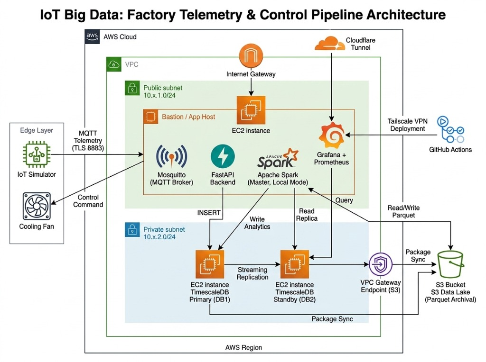

# IoT Big Data: Factory Telemetry and Control Pipeline

> End-to-end IoT telemetry pipeline for factory monitoring with real-time MQTT ingestion, hourly Spark anomaly detection, and millisecond closed-loop actuator control. Self-hosted on AWS, fully automated with Terraform, Packer, and Ansible.

[Infrastructure Guide](docs/infrastructure.md) · [Database Runbook](docs/database.md) · [Spark Analytics](docs/spark-analytics.md) · [Edge Integration](docs/edge-device-integration.md)

---

## Table of Contents

- [What I Built and Why](#what-i-built-and-why)
- [Versions](#versions)
- [Architecture and System Overview](#architecture-and-system-overview)
- [Prerequisites](#prerequisites)
- [Quick Start and Setup](#quick-start-and-setup)
- [Project Directory Layout](#project-directory-layout)
- [Verification and Testing](#verification-and-testing)
- [What I Learned](#what-i-learned)
- [Future Improvements](#future-improvements)
- [Documentation](#documentation)
- [License](#license)

---

## What I Built and Why

### The Problem

A factory floor has three operational zones, each with different environmental risks. If a soldering station overheats, the cooling fan must activate within milliseconds, not minutes. Regulatory bodies require months of environmental records, but storing raw high-frequency sensor data in a database indefinitely is financially unsustainable. And the monitoring system itself cannot be a single point of failure: if the database goes down, a hot standby must take over without data loss.

| Zone | Sensors | Business Risk |
|:---|:---|:---|
| **Production Area** (`ruang_produksi`) | Temperature, Vibration (MPU6050) | Machine overheating or bearing wear halts the assembly line |
| **Soldering Area** (`ruang_penyolderan`) | Temperature, Gas/VOC (MQ-135) | Toxic flux fumes endanger worker health and violate safety regulations |
| **Storage Area** (`ruang_penyimpanan`) | Temperature | Excessive heat damages stored components and raw materials |

### The Solution

This project is a full-stack IoT monitoring pipeline for a simulated manufacturing facility. Sensors across three factory zones continuously stream temperature, vibration, and gas readings to a cloud backend over TLS-encrypted MQTT. The backend validates, stores, and analyzes the data in real time. When a dangerous condition is detected (e.g., overheating), it publishes a control command back to the device within milliseconds.

Raw telemetry is stored in a TimescaleDB time-series database with automatic hypertable partitioning. For long-term retention and heavy analytical workloads, data is exported hourly to Amazon S3 as compressed Parquet files and processed by Apache Spark batch jobs for aggregation and anomaly detection.

The entire infrastructure (networking, compute, security, secrets) is defined as Terraform code and can be deployed to staging or production with a single script.

### Key Engineering Highlights

| Decision | Rationale | Outcome |
|:---|:---|:---|
| Self-hosted TimescaleDB with streaming replication instead of Amazon RDS | Demonstrate WAL management, replication slot configuration, and manual failover procedures | Zero-RPO standby replica with active streaming replication slot |
| Packer custom AMIs with Ansible provisioning instead of bash scripts | v1.0 bash scripts were fragile and not idempotent; re-running them on a live system caused failures | Provisioning time reduced from ~15 min to ~2 min; fully idempotent re-runs |
| Spark Local Mode for hourly batch instead of always-on distributed cluster | CPU utilization sits at 1-2% between hourly runs; dedicated workers waste resources for 59 minutes per hour | 28.56s processing time for 1M records with zero idle resource cost |
| Closed-loop MQTT control instead of one-way telemetry | Factory safety requires immediate actuator response when overheating is detected | Millisecond fan control response via MQTT publish-back from backend |
| Air-gapped database subnet with no internet routing | Database nodes should never be directly reachable from the public internet | Zero attack surface on database layer; S3 access via free VPC Gateway Endpoint |

### Why Self-Hosted Instead of Managed Services?

This project deliberately uses self-hosted open-source components instead of managed cloud services (RDS, EMR, IoT Core) to demonstrate deep systems engineering knowledge:

| Our Decision | Production Alternative | What We Demonstrate |
|:---|:---|:---|
| PostgreSQL + TimescaleDB on EC2 | Amazon RDS / Aurora | Streaming replication configuration, WAL management, manual failover procedures |
| Spark on EC2 (local mode + experimental distributed workers) | AWS EMR / Glue | Ephemeral worker lifecycle benchmarking, coordination overhead analysis, Amdahl's Law validation |
| Docker Compose on a single host | ECS / EKS (Kubernetes) | Container networking, volume persistence, service dependency management |
| Self-hosted Mosquitto | AWS IoT Core / HiveMQ Cloud | TLS certificate provisioning, ACL enforcement, pub/sub topic architecture |

> In a production environment, managed services would be preferred for operational efficiency. The engineering skills demonstrated here (configuring replication slots, debugging VPC routing, analyzing distributed computing overhead) transfer directly to operating and debugging those managed platforms.

---

## Versions

| Version | Tag | Summary |
|:---|:---|:---|
| v1.0 | [`v1.0-college-project`](docs/versions/v1.0.md) | College deadline release: core pipeline, manual provisioning |
| v2.0 | [`v2.0`](docs/versions/v2.0.md) | Terraform IaC, CI/CD, closed-loop control, Packer AMIs, Ansible automation |

---

## Architecture and System Overview



*To generate an automated baseline version of this topology, run `cd docs && python3.12 diagram.py`.*


### Component Breakdown

| Component | Location | Technology | Responsibility |
|:---|:---|:---|:---|
| MQTT Broker | `infra/mosquitto/` | Eclipse Mosquitto 2 | TLS-encrypted IoT telemetry ingestion on port 8883 |
| Backend API | `backend/app/` | FastAPI, Paho MQTT, Uvicorn | MQTT message processing, database writes, closed-loop control |
| Database Cluster | `db/init.sql`, `ansible/roles/patroni/` | PostgreSQL 16, TimescaleDB 2.x, Patroni | HA time-series cluster with automated failover and zero data loss |
| Consensus & L4 Proxy | `ansible/roles/etcd/`, `ansible/roles/haproxy/` | etcd 3.5, HAProxy | Raft DCS quorum and Layer 4 TCP routing for read/write splitting |
| Batch Analytics | `spark-jobs/` | Apache Spark 3.5, PySpark | Hourly aggregation, anomaly detection, S3 Parquet archival |
| IoT Simulator | `simulator/` | Python, Paho MQTT | Multi-device telemetry simulation with anomaly injection |
| Monitoring | `grafana/provisioning/`, `infra/prometheus/` | Grafana, Prometheus, Alloy | Dashboards, alerting (Telegram), metrics collection |
| Infrastructure | `infra/terraform/` | Terraform | VPC, subnets, EC2, IAM, S3, security groups |
| AMI Pipeline | `infra/packer/`, `ansible/` | Packer, Ansible | Custom AMI builds with baked-in packages and configuration |
| CI/CD | `.github/workflows/` | GitHub Actions, Tailscale VPN | Automated deployment to staging and production |

### AWS Network Topology

The infrastructure runs on a custom VPC with public and private subnets in `ap-southeast-1`:

| Subnet | What Lives Here | Internet Access |
|:---|:---|:---|
| **Public** (`10.x.1.0/24`) | Mosquitto, FastAPI, Grafana, Spark Master, etcd (DCS), HAProxy (L4 Proxy) | Yes (via Internet Gateway) |
| **Private** (`10.x.2.0/24`) | `datalayer-1` & `datalayer-2` (Patroni-managed TimescaleDB HA cluster) | None (air-gapped) |

### Security Boundaries

- Database nodes have **no public IP** and **zero internet routing**. All S3 communication goes through the free VPC Gateway Endpoint over AWS internal fiber.
- SSH access to private nodes is only possible by jumping through the applayer host, which requires Tailscale VPN authentication.
- Grafana dashboards are exposed via Cloudflare Tunnel, so no raw web ports are open to the public internet.
- MQTT TLS certificates are provisioned automatically by Certbot using DNS-01 challenge via Cloudflare API.

### Deployment Flow

Infrastructure is provisioned through a three-phase pipeline:

1. **AMI Build (Packer + Ansible):** `packer build` creates custom Amazon Machine Images for both applayer and datalayer nodes. Ansible roles install and pre-configure all software (PostgreSQL 16, TimescaleDB, Java 21, Spark 3.5, Docker, Grafana Alloy) at image build time.

2. **Infrastructure Provisioning (Terraform):** `terraform apply` provisions the VPC, subnets, security groups, S3 buckets, IAM roles, SSM parameters, and launches EC2 instances from the custom AMIs. Each node's `user_data` script registers with the Tailscale mesh VPN on boot.

3. **Post-Deploy Configuration (Ansible):** `run-ansible.sh` dynamically generates an inventory from Terraform outputs, fetches secrets from AWS SSM Parameter Store, and runs Ansible playbooks in dependency order: starting `etcd` DCS, configuring Patroni automated PostgreSQL HA replication, setting up HAProxy Layer 4 read/write splitting, Certbot SSL certificates, Cloudflare Tunnel, and Grafana Alloy monitoring agents.

The master orchestrator script `deploy-environment.sh <staging|production>` runs Terraform plan, apply, and Ansible in sequence with environment-specific variables and S3 state isolation.

### Key Design Decisions

See the full Architecture Decision Records in [`docs/adr/`](docs/adr/):

- **[ADR-001: Decouple Database Layer](docs/adr/ADR-001-decouple-database-layer.md)** - Why PostgreSQL was separated from the application host into dedicated private subnet nodes

---

## Prerequisites

| Tool | Minimum Version | Purpose |
|:---|:---|:---|
| Terraform | 1.11+ | AWS infrastructure provisioning |
| Packer | 1.9+ | Custom AMI builds |
| Ansible | 2.15+ | Configuration management and AMI provisioning |
| AWS CLI | 2.x | AWS authentication and resource inspection |
| Docker | 24.0+ | Container runtime for Mosquitto, Grafana, Prometheus |
| Docker Compose | 2.20+ | Multi-container orchestration on applayer host |
| Python | 3.12+ | Backend, simulator, and Spark analytics |
| Java | 21+ | Apache Spark runtime |
| Tailscale | Latest | Mesh VPN for CI/CD and SSH access to private nodes |

---

## Quick Start and Setup

This project involves multiple infrastructure layers (networking, database provisioning, TLS certificates, DNS configuration). There is no single "quick start" command.

### 1. Bootstrap the Terraform Backend

```bash
cd infra/terraform-bootstrap
terraform init && terraform apply
```

This creates the S3 bucket and DynamoDB table for Terraform remote state locking.

### 2. Build Custom AMIs with Packer

```bash
cd infra/packer

# Build datalayer AMI (PostgreSQL 16, TimescaleDB, Java 21)
packer build datalayer.pkr.hcl

# Build applayer AMI (Docker, Spark 3.5, Grafana Alloy)
packer build applayer.pkr.hcl
```

### 3. Configure Environment Secret Variables

```bash
# Create secret variables file for target environment (e.g. staging or production)
cp infra/terraform/environments/staging.tfvars infra/terraform/environments/staging.secrets.tfvars
# Fill in Cloudflare API tokens, Tailscale auth key, Cloudflare tunnel token
```

> Secrets for deployed EC2 nodes are managed in AWS SSM Parameter Store and fetched dynamically by Ansible during execution.

### 4. Deploy Infrastructure

```bash
cd infra/scripts
./deploy-environment.sh staging    # or: ./deploy-environment.sh production
```

This runs `terraform plan`, `terraform apply`, and `run-ansible.sh` in sequence.

### 5. Verify

After deployment, check that all services are healthy.

> **Note:** Replace `<YOUR_DOMAIN>`, `<MQTT_USER>`, and `<MQTT_PASS>` with your actual values before running.

```bash
# Check MQTT TLS connectivity
mosquitto_pub -h mqtt.<YOUR_DOMAIN> -p 8883 \
  --capath /etc/ssl/certs \
  -u <MQTT_USER> -P <MQTT_PASS> \
  -t "factory/device_001/telemetry" \
  -m '{"temperature": 25.3}'

# Check Grafana dashboard
curl -s https://grafana.<YOUR_DOMAIN>/api/health
```

**Expected output (Grafana health):**
```json
{"commit":"...","database":"ok","version":"..."}

Refer to the [documentation guides](#documentation) for detailed setup instructions per component.
```

## Project Directory Layout

```text
iot-bigdata-project/
├── .github/workflows/              # CI/CD pipeline definitions
│   ├── deploy-staging.yml          # Deploys on push to staging branch
│   └── deploy-production.yml       # Deploys on push to main branch
│
├── ansible/                        # Configuration management
│   ├── ansible.cfg                 # Ansible settings
│   ├── site.yml                    # Main playbook entrypoint
│   ├── packer-applayer.yml         # Packer build playbook for applayer AMI
│   ├── packer-datalayer.yml        # Packer build playbook for datalayer AMI
│   ├── inventory/                  # Host inventory files
│   ├── playbooks/                  # Standalone playbooks
│   ├── roles/                      # Ansible roles
│   │   ├── alloy_agent/            # Grafana Alloy monitoring agent setup
│   │   ├── applayer/               # Certbot SSL, Cloudflare Tunnel, scripts
│   │   ├── timescaledb_primary/    # Primary DB setup, init.sql migration
│   │   └── timescaledb_replica/    # Streaming replication configuration
│   └── templates/                  # Jinja2 templates for configs
│
├── backend/                        # Real-time telemetry ingestion service
│   ├── app/
│   │   ├── main.py                 # FastAPI application entrypoint
│   │   ├── db.py                   # Database connection management
│   │   ├── models/                 # Pydantic data validation schemas
│   │   ├── mqtt/                   # MQTT consumer and control publisher
│   │   └── routes/                 # REST API endpoints
│   └── requirements.txt
│
├── simulator/                      # IoT device telemetry simulator
│   ├── simulator.py                # Multi-device MQTT simulator with anomaly injection
│   └── requirements.txt
│
├── spark-jobs/                     # Batch analytics pipeline
│   ├── batch_analytics.py          # Aggregation and anomaly detection
│   ├── export_to_parquet.py        # TimescaleDB replica to S3 Parquet export
│   ├── run_hourly_pipeline.sh      # Systemd-triggered pipeline orchestrator
│   ├── run_with_worker.sh          # Ephemeral distributed worker launcher
│   ├── generate_bulk_data.py       # Synthetic data generator for benchmarks
│   └── requirements.txt
│
├── benchmarks/                     # Performance testing and comparison
│   ├── bench_ingestion.py          # MQTT ingestion throughput tests
│   ├── bench_spark_idempotency.py  # Spark analytics correctness tests
│   ├── compare_results.py          # Local vs distributed comparison
│   ├── run_comparison.sh           # Benchmark orchestrator script
│   └── results/                    # Benchmark output data
│
├── db/
│   └── init.sql                    # Database schema, hypertables, retention policies
│
├── grafana/provisioning/           # Grafana as-code provisioning
│   ├── alerting/                   # Alert rules and notification policies
│   ├── dashboards/                 # Dashboard JSON definitions
│   └── datasources/                # TimescaleDB and Prometheus connections
│
├── infra/                          # Infrastructure and deployment
│   ├── docker-compose.yml          # Mosquitto, Grafana, Prometheus containers
│   ├── .env.example                # Environment variable template
│   ├── mosquitto/                  # MQTT broker config, TLS certs, ACL
│   ├── prometheus/                 # Scrape targets and recording rules
│   ├── alloy/                      # Grafana Alloy agent configuration
│   ├── systemd/                    # Service and timer unit files
│   ├── packer/                     # AMI build definitions
│   │   ├── applayer.pkr.hcl        # Applayer AMI template
│   │   └── datalayer.pkr.hcl       # Datalayer AMI template
│   ├── scripts/                    # Deployment automation
│   │   ├── deploy-environment.sh   # Master orchestrator (plan, apply, ansible)
│   │   ├── run-ansible.sh          # Dynamic inventory + ansible-playbook runner
│   │   ├── deploy-mqtt-cert.sh     # TLS certificate deployment helper
│   │   └── fetch-secrets.sh        # SSM Parameter Store secret fetcher
│   ├── terraform/                  # Infrastructure as Code
│   │   ├── main.tf                 # Provider and S3 backend configuration
│   │   ├── compute.tf              # EC2 instances and user_data
│   │   ├── network.tf              # VPC, subnets, route tables, endpoints
│   │   ├── security.tf             # Security groups and ingress/egress rules
│   │   ├── secrets.tf              # SSM Parameter Store definitions
│   │   ├── s3.tf                   # Data lake bucket configuration
│   │   ├── variables.tf            # Input variable declarations
│   │   ├── outputs.tf              # Terraform output values
│   │   └── environments/           # Per-environment tfvars files
│   └── terraform-bootstrap/        # One-time S3 backend and DynamoDB setup
│
├── docs/                           # Technical documentation
│   ├── architecture.jpg            # System topology architecture diagram
│   ├── diagram.py                  # Diagrams-as-Code generator (Python)
│   ├── infrastructure.md           # AWS topology and architecture
│   ├── database.md                 # Replication, failover, and WAL management
│   ├── spark-analytics.md          # Pipeline design and scaling benchmarks
│   ├── edge-device-integration.md  # MQTT payload schemas and validation
│   ├── retrospective.md            # Chronological engineering failure log
│   ├── adr/                        # Architecture Decision Records
│   └── versions/                   # Release notes per version
│
├── .gitignore
├── LICENSE
└── README.md
```

---

## Verification and Testing

### MQTT Ingestion Test

Start the simulator to verify the full ingestion path (simulator to Mosquitto to FastAPI to TimescaleDB):

```bash
cd simulator
python3.12 simulator.py
```

Expected output:
```
Connected to MQTT broker at mqtt.your-domain.com:8883
Publishing telemetry for device_001 (ruang_produksi)...
Publishing telemetry for device_002 (ruang_penyolderan)...
Publishing telemetry for device_003 (ruang_penyimpanan)...
```

### Spark Analytics Pipeline

Manually trigger the hourly batch pipeline on `applayer-1`:

```bash
sudo systemctl start iot-analytics.service
sudo journalctl -u iot-analytics.service --no-pager -n 20
```

Expected output:
```
=== [date] Memulai Pipeline Batch Spark per-Jam ===
Menjalankan export_to_parquet.py...
Berhasil query N baris dari DB
Upload ke S3: s3://bucket-name/raw/sensor_YYYYMMDD_HHMMSS_YYYYMMDD_HHMMSS.parquet
Memicu spark-submit untuk batch_analytics.py...
=== [date] Pipeline Batch Spark Jam-an Selesai dengan Sukses ===
```

### Database Replication Status

Verify streaming replication is active on `datalayer-1`:

```sql
SELECT client_addr, state, sent_lsn, write_lsn, replay_lsn
FROM pg_stat_replication;
```

Expected: one row with `state = streaming` and matching LSN values.

### Benchmark Suite

Run the full Spark local-vs-distributed comparison (uses custom Python scripts with PySpark and SQLAlchemy):

```bash
cd benchmarks
./run_comparison.sh
```

This runs `batch_analytics.py` across Local Mode, 1-Worker, and 2-Worker configurations, comparing execution time, record counts, and idempotency. Results are saved to `benchmarks/results/`.

See [Spark Analytics Guide](docs/spark-analytics.md) for benchmark methodology, Amdahl's Law analysis, and full results.

---

## What I Learned

### 1. Air-Gapped Subnets Block Software Installation

**Challenge:** Database nodes in the private subnet have zero internet routing. Standard `dnf install` and `pip install` commands fail completely, making it impossible to install PostgreSQL, TimescaleDB, or Java through conventional means.

**Solution:** v1.0 used a package relay pipeline: the applayer node downloads all RPMs, uploads them to S3, and private nodes pull packages through the free VPC Gateway Endpoint. v2.0 replaced this entirely with Packer custom AMIs that bake all packages at image build time using Ansible roles.

**Outcome:** v1.0 package relay took approximately 15 minutes per node. v2.0 Packer AMIs reduced provisioning to approximately 2 minutes (boot to fully configured).

**Deep-dive:** [Infrastructure Guide](docs/infrastructure.md)

---

### 2. Distributed Computing: Amdahl's Law in Practice

**Challenge:** Assumed adding Spark workers would improve batch processing speed linearly. Deployed ephemeral EC2 workers to distribute the Spark workload.

**Solution:** Benchmarked three configurations (Local Mode, 1 Worker, 2 Workers) across two dataset sizes on `t3.small` instances (1 vCPU, 2GB RAM) running Apache Spark 3.5.

**Outcome:**

#### 1,000,000 Records (~64MB Parquet)

| Scenario | Workers | Avg Duration |
|:---|:---|:---|
| Local Mode | 0 | **28.56 s** |
| 1 Distributed Worker | 1 | **42.47 s** |
| 2 Distributed Workers | 2 | **44.13 s** |

**Finding: Negative Scaling.** For datasets smaller than single-node RAM capacity, distributed coordination overhead (JVM startup, network shuffles, database connection contention) exceeds the parallel computation benefit.

#### 5,000,000 Records (~320MB Parquet)

| Scenario | Workers | Result |
|:---|:---|:---|
| Local Mode (Master Only) | 0 | **Fatal Crash (OOM)** |
| 1 Distributed Worker | 1 | **155.77 s** |
| 2 Distributed Workers | 2 | **211.29 s** |

**Finding: The Architectural Necessity of Distribution.** When processing the 5M dataset, Local Mode exhausted the master node's 512MB heap limit, causing a fatal OS kernel panic due to a `/tmp` RAM disk spill. Offloading compute to dedicated Ephemeral Workers protected the master node. 1 Worker remained faster than 2 Workers due to database lock contention during concurrent writes.

The production workflow runs in Local Mode for cost efficiency. Ephemeral distribution is validated as a scaling path for datasets exceeding single-node memory capacity.

**Deep-dive:** [Spark Analytics Guide](docs/spark-analytics.md)

---

### 3. Infrastructure Provisioning Has Hidden Timing Dependencies

**Challenge:** Terraform's `local-exec` provisioner fires immediately after `aws_instance` resource creation, but the EC2 instance's SSM agent takes 30-60 seconds to register with AWS Systems Manager. Remote commands fail with "instance not found."

**Solution:** Added a polling loop that waits for SSM `PingStatus = Online` before sending remote commands.

**Outcome:** Eliminated the race condition. `terraform apply` completes reliably without manual retries.

**Deep-dive:** [Staging Retrospective](docs/retrospective.md)

---

## Future Improvements

While the current architecture successfully proves the end-to-end flow of IoT telemetry, the following evolution paths are identified for operational maturity and deeper systems engineering practice:

### Completed (v2.0)

- **Configuration Management (Ansible):** Replaced fragile bash provisioning scripts with idempotent Ansible playbooks and roles (`timescaledb_primary`, `timescaledb_replica`, `applayer`, `alloy_agent`). Scripts are now safe to re-run on live systems.
- **Custom AMI Pipeline (Packer):** Baked PostgreSQL 16, TimescaleDB, Java 21, Spark 3.5, Docker, and Grafana Alloy into pre-built AMIs using Packer with Ansible provisioners. Eliminated the S3 RPM relay pipeline and reduced node provisioning time from ~15 minutes to ~2 minutes.

### Near-Term (Planned)

- **Containerized Orchestration (Kubernetes):** Migrate Docker Compose services (FastAPI backend, Mosquitto, Grafana stack) and systemd-managed services to a lightweight Kubernetes cluster (K3s). Unifies service lifecycle management, adds application-level health probes (`livenessProbe`/`readinessProbe`), and enables rolling zero-downtime deploys.
- **Spark on Kubernetes:** Replace the systemd timer-driven Spark pipeline with Kubernetes-native Spark Operator. Spark driver/executor pods are scheduled as K8s workloads with proper resource limits, retry policies, and execution visibility.
- **Container CI/CD Pipeline:** Evolve the current SSH-based deployment to a container image pipeline: build Docker images in GitHub Actions, push to Amazon ECR, and deploy to K3s via `kubectl apply`.

---

## Documentation

| Document | Description |
|:---|:---|
| [Infrastructure Guide](docs/infrastructure.md) | VPC topology, security groups, IAM policies, and architecture decisions |
| [Database Runbook](docs/database.md) | TimescaleDB setup, streaming replication, and failover procedures |
| [Spark Analytics Guide](docs/spark-analytics.md) | Batch pipeline design, ephemeral workers, and scaling benchmarks |
| [Edge Integration Specs](docs/edge-device-integration.md) | MQTT payload schemas, validation rules, and NTP synchronization |
| [Staging Retrospective](docs/retrospective.md) | Chronological catalog of infrastructure failures and fixes |
| [ADR-001](docs/adr/ADR-001-decouple-database-layer.md) | Architecture Decision Record: Decouple Database Layer |

---

## License

This project is licensed under the [MIT License](LICENSE).

---

