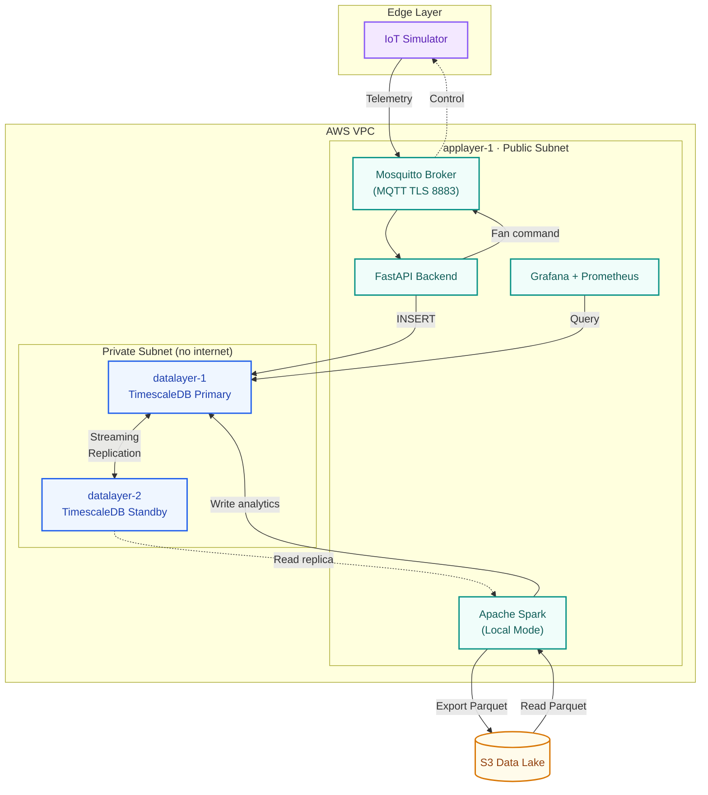

# v1.0 — College Project Release

> **Tag:** [`v1.0-college-project`](https://github.com/luqman126/factory-telemetry/releases/tag/v1.0-college-project)  
> **Branch:** `main` (at time of tagging)  
> **Date:** Initial project deadline submission

---

## Summary

The first complete version of the IoT Big Data pipeline, built to fulfill a college project requirement. This version demonstrates an end-to-end flow from IoT sensor ingestion through real-time storage to batch analytics, all running on self-hosted infrastructure on AWS.

All documentation in this version was written in Indonesian.

---

### Architecture

| Mode | Usage | Purpose |
|---|---|---|
| Local Mode (`run_hourly_pipeline.sh`) | **Production** — hourly via systemd timer | Daily analytics pipeline |
| Ephemeral Workers (`run_with_worker.sh`) | **Experimental** — manual execution only | Scaling benchmarks and Amdahl's Law analysis |

---

## Tech Stack

| Category | Technologies |
|---|---|
| **Languages** | Python 3.12, SQL, Bash |
| **Backend** | FastAPI, Pydantic, Paho MQTT, Uvicorn |
| **Database** | PostgreSQL 16, TimescaleDB 2.x (hypertables + retention policies) |
| **Analytics** | Apache Spark 3.5 (PySpark), Local Mode |
| **Broker** | Eclipse Mosquitto (MQTT over TLS) |
| **Cloud** | AWS EC2, S3, IAM, VPC Gateway Endpoints |
| **Infrastructure** | Docker Compose, Tailscale VPN, Cloudflare Tunnel |
| **Monitoring** | Prometheus, Grafana, Grafana Alloy, Telegram Alerting |

---

## What Was Manual

At v1.0, several operational tasks required manual intervention:

- **Infrastructure provisioning:** EC2 instances created via AWS Console, not IaC. VPC, subnets, security groups, and IAM roles were configured manually.
- **Database setup:** SSH into each node, SCP scripts, run `provision-db-primary.sh` / `provision-db-replica.sh` manually.
- **Alloy monitoring agent:** Config file existed but setup on each node was manual.
- **Deployment:** `git pull` + `systemctl restart` via SSH. No CI/CD pipeline.
- **MQTT credentials:** Shared credentials, no per-device ACL enforcement.

---

## Known Limitations

1. No Infrastructure as Code — entire AWS environment was click-ops + manual scripts
2. No CI/CD pipeline — deployment required SSH access and manual commands
3. MQTT ACL not enforced — all devices shared the same credentials
4. Documentation in Indonesian — limited accessibility for public repository
5. Provisioning scripts not idempotent — re-running could corrupt existing state
6. No secret management — credentials managed via `.env` files only

---

## What Was Planned Next

The v1.0 README outlined three future improvements:

1. **Terraform IaC** — ✅ Implemented in v2.0
2. **CI/CD Pipeline (GitHub Actions)** — ✅ Implemented in v2.0
3. **Real-Time Streaming Analytics** — Deferred to long-term roadmap
