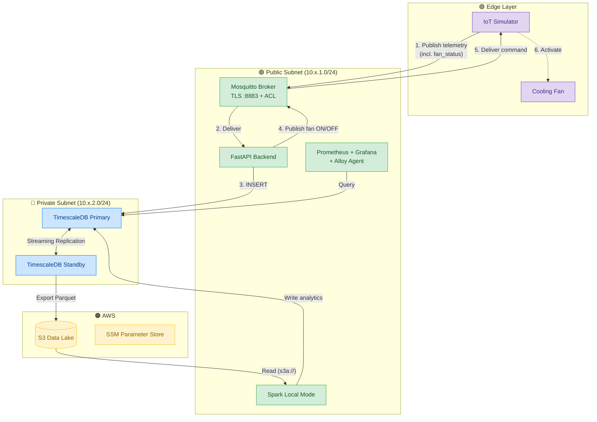
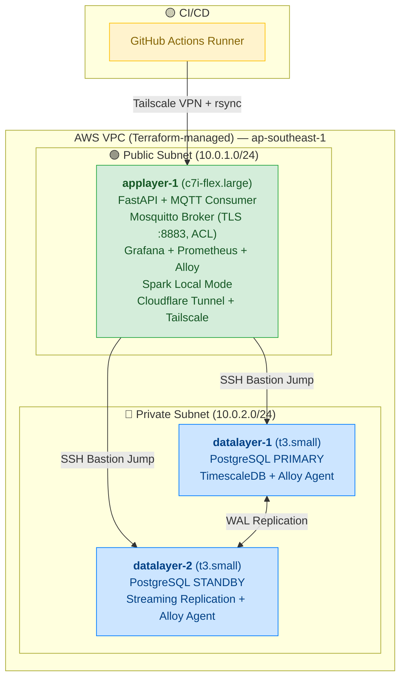

# v2.0 — Automation & Operability Upgrade

> **Tag:** [`v2.0`](https://github.com/karasu126/iot-bigdata-project/releases/tag/v2.0)  
> **Branch:** `main` (merged from `staging`)  
> **Date:** July 2026  
> **Commits over v1.0:** ~80

---

## Summary

Post-deadline improvements focused on three areas: **infrastructure automation**, **operational hardening**, and **closed-loop actuator control**. The core pipeline (MQTT → FastAPI → TimescaleDB → Spark → S3) is unchanged, but the surrounding automation and operability has been fundamentally rebuilt.

The two v1.0 roadmap items — Terraform IaC and CI/CD Pipeline — are both delivered in this version.

---

## What Changed from v1.0

### At a Glance

| Area | v1.0 | v2.0 |
|---|---|---|
| Infrastructure provisioning | Manual (AWS Console + scripts + SCP) | Terraform IaC + SSM + S3 bootstrap pipeline |
| CI/CD | None | GitHub Actions + Tailscale VPN + rsync deploy |
| Actuator control | One-way (backend → fan command) | Closed-loop (device reports `fan_status` back in telemetry) |
| MQTT security | Shared credentials | Per-device ACL enforcement |
| Monitoring setup | Alloy config existed, manual setup per node | Templated config + scripted multi-node deployment |
| Secret management | `.env` files only | SSM Parameter Store + dynamic fetch scripts |
| Documentation | Indonesian, scattered runbooks | English, consolidated + ADR format |
| Spark workflow | Local mode + experimental ephemeral workers | Local mode (clarified; ephemeral documented as benchmarking only) |
| Spark tuning | Default configs | OOM fix, partition scaling, G1GC, memory limits |
| Security groups | Not in code (manual console) | Terraform-managed, source security group scoped |

---

### Major Improvements in Detail

#### 1. Infrastructure as Code (Terraform)

The entire AWS environment is now defined in Terraform:

- VPC, subnets, routing tables, internet gateway
- Security groups with source SG scoping (not CIDR blocks)
- EC2 instances with user_data bootstrapping
- IAM roles and instance profiles (least privilege)
- S3 bucket and VPC Gateway Endpoint
- SSM Parameter Store for secrets
- `local-exec` provisioners for automated post-deploy setup

**Files added:** `infra/terraform/` directory (10 files: `main.tf`, `compute.tf`, `network.tf`, `security.tf`, `secrets.tf`, `s3.tf`, `variables.tf`, `outputs.tf`, `environments/staging.tfvars`, `README.md`)

#### 2. Automated Provisioning Pipeline

Private subnet nodes cannot reach the internet, so a package relay pipeline was built:

```
applayer-1 (bastion, public subnet)
  → downloads PostgreSQL, TimescaleDB, Alloy RPMs
  → uploads to S3
  → datalayer nodes poll for sync_complete.flag
  → pull RPMs from S3 via VPC Gateway Endpoint
  → install and configure autonomously
```

**Scripts added:** `sync-packages-to-s3.sh`, `local-bootstrap.sh`, `fetch-secrets.sh`, `setup-alloy-nodes.sh`, `render_alloy_config.py`

#### 3. CI/CD Pipeline (GitHub Actions + Tailscale)

Automated deployment on push to staging branch:
- Tailscale VPN connection from GitHub runner
- Rsync-based code sync (replaced `git pull`)
- Remote service restart via SSH
- DB schema updates forwarded through bastion jump

**File added:** `.github/workflows/deploy-staging.yml`

#### 4. Closed-Loop Actuator Control

v1.0 had one-way control: backend detects overheat → publishes fan ON command. But the backend had no way to know if the fan was already on — it used local state tracking which could drift.

v2.0 introduces `fan_status` in the sensor telemetry payload. The device reports its actual fan state back to the backend. The control logic now reads `payload.fan_status` directly instead of tracking state locally, eliminating state drift between backend and device.

#### 5. Documentation Overhaul

- All documentation translated from Indonesian to English
- Runbooks consolidated: `runbook-db-setup.md` and `runbook-spark-setup.md` merged into `database.md` and `spark-analytics.md`
- Added `retrospective.md` — chronological catalog of infrastructure failures and fixes
- Added `ADR-001-decouple-database-layer.md` — formal architecture decision record
- Added `edge-device-integration.md` — MQTT payload schemas and validation rules

---

## Architecture

### Data Flow (v2.0)



### Infrastructure Topology (v2.0)



### What Did NOT Change

- Core pipeline flow (MQTT → FastAPI → TimescaleDB → Spark → S3) — identical
- 3-node topology (applayer-1 + datalayer-1 + datalayer-2) — identical
- Spark runs in Local Mode on applayer-1 — identical
- Docker Compose for services on applayer-1 — identical (not yet migrated to K8s)
- Hourly batch analytics via systemd timer — identical

---

## Tech Stack Additions

| Category | Added in v2.0 |
|---|---|
| **Infrastructure** | Terraform (HCL) |
| **CI/CD** | GitHub Actions, Tailscale VPN |
| **Secret Management** | AWS SSM Parameter Store |
| **Deployment** | rsync-based push deploy |
